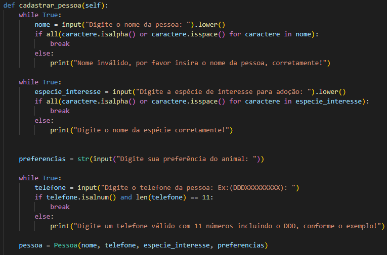
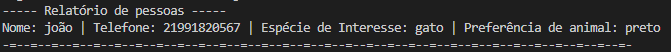

## Alunos:   Lucas Cerqueira F. Carneiro - 202211189   Gabriel Bastos Vidal - 202212035

## <a><a href="https://github.com/marciogarridoLaCop">Professor: Márcio Garrido</a></a> 
## Engenharia de Software 
#
 

# Problema proposto:
A Universidade de Vassouras do Campus 1 foi convidada pela prefeitura de Maricá para promover uma solução tecnológica em um dos problemas sociais da cidade, o abandono de animais. Mesmo considerado crime (O abandono de animais é crime, previsto na Lei de Crimes Ambientais - Lei Federal n° 9.605 de 1998), e notório que o índice de abandono vem crescendo a cada ano.

Os alunos do curso de Engenharia de Software foram convocados para a reunião com a secretaria da cidade para entender a demanda solicitada e alguns pontos foram levantados.

A prefeitura precisa de um sistema que possa cadastrar todos os animais por tipo (canino, felino, etc.) e para tanto, é uma premissa que seja possível inserir novos tipos dinamicamente. Precisa ainda, que sejam classificados por idade aproximada, cor, porte e se possui alguma particularidade. No mesmo sistema, deverá ter também um cadastro de pessoas interessadas na adoção, contendo os dados principais de contato e qual espécie teria o interesse de adotar. Ao escolher a espécie, deve também informar se possui alguma preferência do animal. Por fim, no final do mês a prefeitura emitirá um relatório de cruzamento de espécies disponíveis x possíveis candidatos, ou quando um candidato a adoção ligar, que o atendente possa pesquisar se há algum animal com as características informadas.

Os alunos anotaram atentamente a todas as observações, criaram o fluxograma do estudo de caso, e posteriormente o primeiro protótipo em Python, ainda que em modo texto, e sem requisitos gráficos. A ideia foi apenas validar a proposta do programa junto ao solicitante.
#
 

# Solução Proposta: Solução Caramelo

## Este é um programa que permite cadastrar animais e pessoas, emitir relatórios e realizar buscas de animais com base em suas características. A solução é implementada usando a linguagem Python.
#
 

 # Funcionalidades do projeto

 - <strong>Cadastrar Animal:</strong> O programa permite cadastrar informações sobre animais, como tipo, cor, porte, particularidade e idade aproximada. Ele solicita os dados ao usuário e, em seguida, cria um objeto Animal com essas informações e o adiciona à lista de animais cadastrados.
 

- <strong>Cadastrar Pessoa:</strong> O programa permite cadastrar informações sobre pessoas interessadas em adoção de animais. É solicitado o nome da pessoa, a espécie de interesse para adoção, as preferências de animal e o telefone de contato. Em seguida, um objeto Pessoa é criado com essas informações e adicionado à lista de pessoas cadastradas. 

- <strong>Emitir Relatório:</strong> O usuário pode escolher emitir diferentes relatórios. Existem três opções:
 

 - <strong>Relatório de Animais:</strong> Exibe uma lista com informações de todos os animais cadastrados, incluindo tipo, cor, porte, particularidade e idade.

- <strong>Relatório de Pessoas:</strong> Mostra uma lista com informações de todas as pessoas cadastradas, incluindo nome, telefone, espécie de interesse e preferências de idade de animal.

- <strong>Relatório de Compatibilidade:</strong> Gera um relatório mostrando quais animais são compatíveis com as preferências das pessoas cadastradas. Compara a espécie de interesse e as preferências de cor, porte e idade entre os animais e as pessoas, mostrando os resultados.

- <strong>Buscar Animais:</strong> Permite ao usuário buscar animais com base em características específicas. O usuário pode inserir uma palavra-chave relacionada ao tipo, cor, porte ou particularidade do animal.
 

 

O programa então busca na lista de animais cadastrados e exibe os resultados correspondentes.

 

